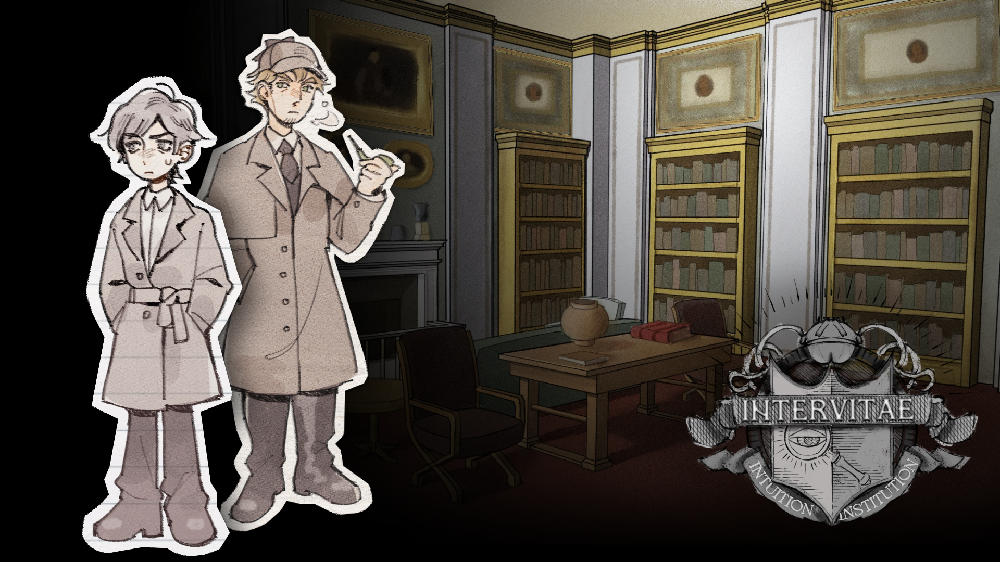

# 《灵途：直觉学院》



> 一款通过“证词互相质疑”推进推理的学院侦探叙事游戏。

---

## 项目定位

《灵途：直觉学院》是一款以“学院 + 侦探”为主题的叙事推理游戏。

玩家将扮演一名进入神秘学院的实习侦探，通过与角色对话、记录证词、分析矛盾与整理线索，逐步推进案件调查并揭示真相。

项目整体希望营造一种：

- 亲自参与推理
- 主动整理逻辑
- 在对话中寻找漏洞

的侦探体验。

---

## 核心体验目标

相比传统“提交正确证据”的推理游戏，

本项目更希望玩家：

- 主动思考角色之间的话语冲突
- 建立证词之间的逻辑联系
- 通过交互参与推理过程

而不是单纯“试答案”。

我们希望玩家感受到：

> “我是通过自己的推理发现矛盾的。”

---

## 核心玩法循环

```text
与角色对话
↓
记录可疑证词
↓
拖拽到线索板
↓
与旧证词进行比对
↓
发现矛盾
↓
推进剧情
```

---

## 核心机制设计

### 线索板系统

游戏中的核心交互为：

“用证词质疑证词”。

玩家可以：

- 记录 NPC 发言
- 将可疑内容拖拽到线索板
- 与已有证词进行逻辑比对

当系统检测到矛盾时：

- 会触发新的剧情推进
- 解锁新的对话内容
- 或进入证据反驳阶段

这一机制希望强化：

- 推理参与感
- 玩家主动分析
- 对人物关系与逻辑的理解

而不是依赖系统直接给出答案。

---

## 为什么这样设计

传统推理游戏中，

玩家往往只需要：

- 选择正确证据
- 点击正确选项

推理过程容易变成“猜答案”。

因此本项目尝试让玩家：

主动建立“证词与证词之间”的逻辑关系。

相比“提交物品证据”，

我们更希望玩家关注：

- 人物说了什么
- 前后逻辑是否矛盾
- 信息之间是否冲突

从而强化真实推理感。

---

## 设计难点

### 新交互学习成本较高

由于：

“拖拽证词进行逻辑比对”

并不是常见推理游戏中的主流交互方式，

因此很多玩家在初次体验时会出现：

- 不知道哪些内容可以互动
- 不理解为什么需要拖拽
- 不知道如何触发矛盾

等问题。

---

## 教程引导设计

为了降低玩家学习成本，

项目在教程部分加入了：

- 动态箭头提示
- 焦点高亮
- 分步骤交互限制
- UI 动线引导

逐步引导玩家完成：

```text
点击
↓
拖拽
↓
比对
↓
触发矛盾
```

确保玩家能够理解整个推理系统的运作方式。

---

## 后续可扩展方向

如果继续开发，

未来希望加入：

- 多重矛盾链
- 时间线推理
- 人物关系网
- 错误推理分支
- 更自由的证据组合系统

进一步提升推理自由度与叙事张力。

---

## 我的职责

我主要负责：

- 核心交互设计
- 线索板系统设计
- 教程引导设计
- UI 交互流程
- 部分 Unity 功能实现
- 系统逻辑整合与调试

---

## 项目关键词

`叙事设计`  
`推理玩法`  
`交互设计`  
`教程引导`  
`线索系统`  
`UI/UX`  
`Unity`
