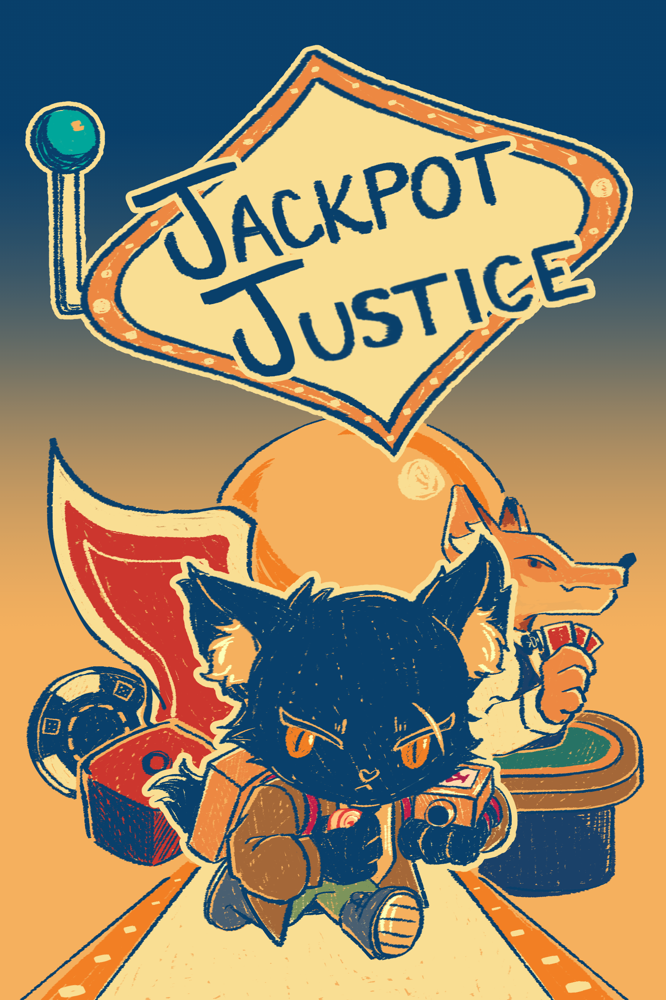

# 《Jackpot Justice》



> 一款将老虎机随机机制与动作战斗结合的实验性 Roguelike 游戏。

---

## 项目定位

《Jackpot Justice》是一款强调：

- 随机性
- 即时应变
- 爽感反馈

的动作 Roguelike 游戏。

玩家通过拉动老虎机随机生成武器，并在有限时间内使用这些武器进行战斗。

项目整体希望营造一种：

> “下一把武器会发生什么？”

的持续期待感。

---

## 核心体验目标

本项目希望玩家始终处于：

- 对未知结果的期待
- 对随机武器的快速适应
- 高风险与高回报之间的决策

之中。

相比传统 Roguelike 中：

“长期培养一套 Build”

本项目更强调：

- 临时应变
- 快速切换战斗方式
- 即时反馈

让玩家不断适应新的战斗节奏。

---

## 核心玩法循环

```text
拉动老虎机
↓
获得随机武器
↓
短时间战斗
↓
武器失效
↓
重新赌博
↓
继续战斗
```

---

## 核心机制设计

### 老虎机武器系统

玩家通过老虎机生成武器。

老虎机会随机组合：

- 武器类型
- 属性效果
- 特殊词条

例如：

- 爆炸
- 追踪
- 冰冻
- 吸血
- 弹跳

不同组合会形成完全不同的战斗体验。

---

## Jackpot 机制

当老虎机三排图案完全一致时，

玩家会触发：

### Jackpot 状态

并获得：

- 特殊武器
- 更强攻击效果
- 额外视觉反馈
- 强化音效表现

这一机制希望创造：

- 高峰时刻
- 赌博式快感
- “中大奖”的情绪反馈

强化玩家对随机系统的期待。

---

## 为什么武器不能永久持有

项目初期曾尝试：

允许玩家长期保留强力武器。

但测试后发现：

玩家会停止尝试新组合，

导致：

- 战斗节奏变慢
- 随机系统失去意义
- 玩法趋于固定

因此最终改为：

### 武器限时使用机制

迫使玩家：

- 快速理解武器特性
- 临时调整打法
- 持续尝试新的组合

从而保持玩法变化与战斗节奏。

---

## 成长与解锁设计

随着游戏推进，

玩家会逐渐解锁更多老虎机图案。

包括：

- 新武器类型
- 复合属性
- 特殊词条
- 更复杂组合

图案数量增加后，

玩家面对的选择与组合可能性也会不断提升。

---

## 设计难点

### 随机性与可控性的平衡

如果随机性过强：

玩家会觉得无法掌控。

如果随机性过弱：

老虎机系统会失去意义。

因此项目在设计中需要平衡：

- 随机乐趣
- 玩家策略
- 爽感反馈
- 战斗可读性

避免游戏完全依赖运气。

---

## 后续可扩展方向

未来希望加入：

- 武器合成系统
- 特殊 Jackpot 连锁效果
- Boss 专属词条
- 风险奖励关卡
- 更复杂的 Build 联动

进一步强化随机构筑体验。

---

## 我的职责

我主要负责：

- 核心玩法设计
- 老虎机武器系统设计
- 战斗循环设计
- 随机机制设计
- 玩家反馈调整
- 部分 Unity 功能实现

---

## 项目关键词

`玩法设计`  
`Roguelike`  
`随机机制`  
`战斗循环`  
`风险收益设计`  
`玩家反馈`  
`Unity`
