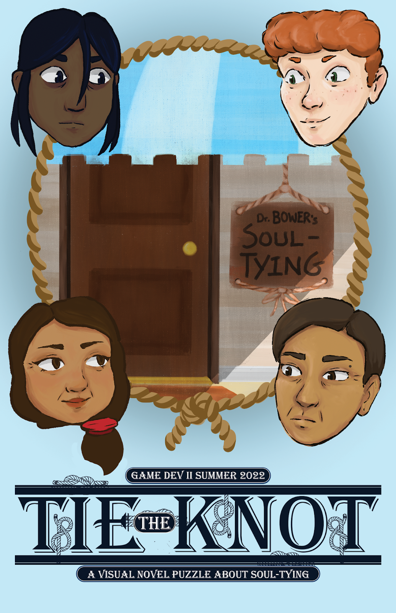

# 《Tie the Knot》



> 一款通过“打结”表现人物情绪与心理状态的叙事解谜游戏。

---

## 项目定位

《Tie the Knot》是一款以“打结”为核心交互的叙事解谜游戏。

游戏将：

- 绳结
- 情绪
- 心理状态

进行具象化表达。

玩家需要在有限空间内绘制不同形状的“结”，帮助来访者完成心理疏导。

项目整体希望营造一种：

- 安静
- 沉浸
- 带有情绪表达

的解谜体验。

---

## 核心体验目标

相比传统解谜游戏中：

“寻找唯一正确答案”

本项目更希望玩家感受到：

- 情绪与空间的关系
- 路径规划带来的思考过程
- “解开心结”的象征体验

让玩法与叙事形成统一。

---

## 核心玩法循环

```text
聆听角色故事
↓
理解情绪主题
↓
在点阵空间中绘制绳结
↓
完成目标结构
↓
推进角色剧情
```

---

## 核心机制设计

### 绳结绘制系统

玩家需要在固定点阵中：

- 连接节点
- 绘制路径
- 完成指定绳结结构

部分节点会被封锁，

因此玩家需要：

- 提前规划路线
- 调整路径顺序
- 思考空间排布

---

## 情绪与绳结设计

不同关卡中的绳结：

对应不同心理状态。

例如：

- 焦虑
- 依赖
- 自责
- 压抑

项目希望通过：

“复杂的结”

去象征：

“复杂的情绪状态”。

让玩法结构与叙事主题保持统一。

---

## 多结组合机制

部分关卡要求：

玩家在同一空间内完成多个结。

这一机制会进一步考验：

- 空间规划能力
- 路径预判
- 资源利用

同时提升后期关卡复杂度。

---

## 为什么选择点阵结构

项目初期曾尝试：

自由拖拽式绳索玩法。

但测试后发现：

- 操作难以控制
- 路径容易混乱
- 解谜可读性较差

因此最终改为：

### 固定点阵结构

让玩家能够：

- 更清晰地规划路径
- 更容易理解规则
- 更专注于解谜本身

同时也降低了操作门槛。

---

## 视觉反馈设计

为了降低玩家卡关率，

项目加入了：

- 绳索颜色变化
- 节点高亮
- 回弹反馈
- 错误路径提示

帮助玩家理解当前状态与操作结果。

---

## 后续可扩展方向

未来希望加入：

- 动态节点变化
- 更复杂的空间结构
- 情绪分支系统
- 多角色关联谜题
- 更自由的绳结组合方式

进一步提升玩法深度。

---

## 我的职责

我主要负责：

- 核心玩法设计
- 绳结交互逻辑设计
- Tutorial 引导设计
- 玩家反馈调整
- 部分 Unity 功能实现
- 解谜流程调试

---

## 项目关键词

`解谜设计`  
`叙事设计`  
`空间规划`  
`交互设计`  
`玩家引导`  
`情绪表达`  
`Unity`
